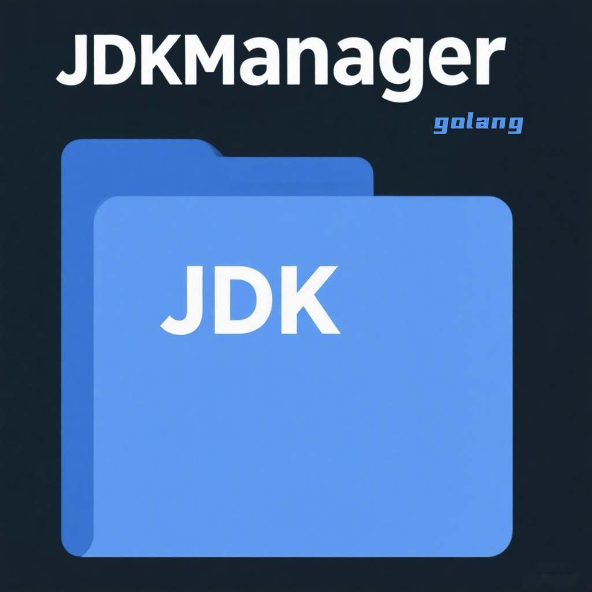

# jdkmanager
The final solution for jdk management in Windows


一个基于 Go 开发的 Windows JDK 环境管理工具，支持多版本切换和自动环境配置。

## 🚀 功能特性

- ✅ 自动检测已安装的 JDK 版本
- ✅ 安全修改 `JAVA_HOME` 和 `PATH` 环境变量
- ✅ 注册表永久存储配置
- ✅ 即时通知系统更新环境变量
- ✅ 支持管理员/普通用户模式

## 📦 安装

### 从源码编译
```cmd
git clone https://github.com/yourname/jdkmanager.git
cd jdkmanager
go build -o jdkmanager.exe
```

### 二进制安装（推荐）
从 [Releases](https://github.com/Gi1gamesh666/jdkmanager/releases) 下载对应版本：

